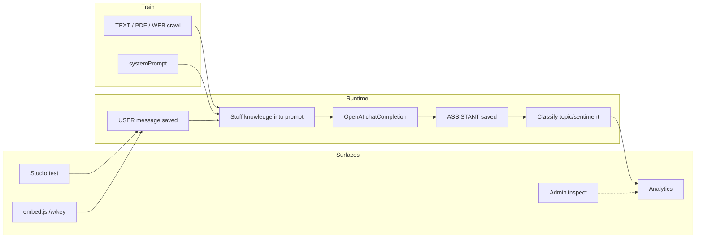
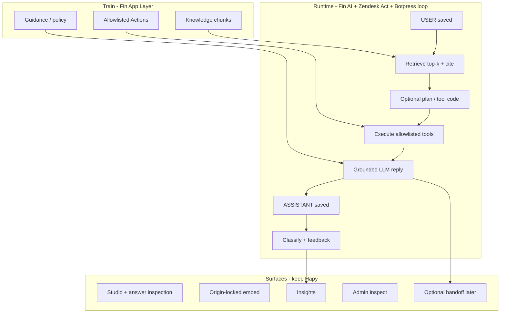

# Hapy fusion plan — unique product from Zendesk × Intercom × Botpress

**Purpose:** One main roadmap that **merges** the best architectural ideas from the three audits **without** cloning any of them, and **aligns** with current Hapy flow + Week 3 (P1) + named OOS (P3) in [`POST_MVP_BACKLOG_PLAN.md`](POST_MVP_BACKLOG_PLAN.md).  

**Sibling audits:**

- [`AUDIT_ZENDESK_VS_HAPY.md`](AUDIT_ZENDESK_VS_HAPY.md) — Resolution / multi-agent / tools  
- [`AUDIT_INTERCOM_VS_HAPY.md`](AUDIT_INTERCOM_VS_HAPY.md) — Fin RAG flywheel / Guidance / Procedures  
- [`AUDIT_BOTPRESS_VS_HAPY.md`](AUDIT_BOTPRESS_VS_HAPY.md) — LLMz / Autonomous / Studio  

**Rule (internship):** Week 3 = few engineering items; **no horizontal product expansion**. P3 stays closed until explicitly reopened. **Never:** train on private customer data; open-web competitor scrape.

---

## 1. What each giant is “best at” (steal list)

| Source | Steal (idea) | Do **not** steal |
|--------|--------------|------------------|
| **Zendesk** | Plan → retrieve → **act** → learn; visible multi-step resolution; tool integrations | Full helpdesk, WFM, 1800-app marketplace, contact center |
| **Intercom Fin** | Semantic **RAG + rerank**; Guidance; clarify-when-unsure; train→test→deploy→analyze flywheel; answer inspection | Omnichannel empire, outcome billing, custom CX model farm |
| **Botpress** | Tool/code **agent loop**; strict tool schemas; feedback learning; “acts not only answers” | Visual flow canvas as identity; multi-channel Desk clone |

---

## 2. Hapy’s unique spine (protect this)

Do not dilute these — they are why Hapy is not a Fin/Zendesk/Botpress clone:

1. **Workspace-scoped agents** — hard isolation (W2 hides W1).  
2. **Origin-locked embed** — one live https site per agent + one-time crawl.  
3. **Insights-native MVP** — every chat classified (topic/sentiment) → analytics (product + **platform admin**).  
4. **One platform admin**, inspect-only, `/admin` 404 for users — trust plane without impersonation.  
5. **Answer-from-knowledge** grounding (system prompt + refuse) as default ethics.

**Positioning line (fusion):**

> Hapy is the **site-bound AI support agent with built-in customer insights and a locked embed** — Fin-quality answers over time, Zendesk-style *actions* when you opt in, Botpress-grade *reliability* without a flow canvas.

---

## 3. Current Hapy flow (as-is)



**Gap vs fusion targets:** no retrieve/rerank, no tools, no handoff, no Guidance object, no learning loop.

---

## 4. Target Hapy architecture (fusion — still one product)



---

## 5. Phased plan (aligned to backlog bands)

### Band 0 — Done / freeze identity (now)

- Keep embed origin lock, workspaces, admin A0–A6, classify analytics.  
- Finish any open **P0** ops (admin live smoke if credentials match Vercel).  
- Do **not** start P3 while closing internship pack.

### Band 1 — Week 3 / P1 (pick **two or three** only)

Aligned to Fin/Zendesk/Botpress *quality* without new product surfaces:

| Pick | ID | Fusion value |
|------|-----|----------------|
| A | **W3-1** Better stuffing | Mini-RAG without vectors (Fin retrieve lite) |
| B | **W3-3** Better prompts | Guidance lite (tone, policy, refuse) |
| C | **W3-4** Logging | Zendesk/Botpress ops reliability |
| D | **W3-5** Performance | Analytics/chat latency |
| E | **W3-7** UI polish | Studio/embed demo quality |

**Recommended trio for “competitor climb”:** **W3-1 + W3-3 + W3-4**.

**Deliverables in this band:**

- Cite knowledge **titles** in stuffed prompt; stop blind truncate.  
- Prompt templates: grounding + short/long.  
- Studio: “Used knowledge: …” under replies (Fin answer inspection lite).  
- Request-id in logs.

### Band 2 — P2 (only if it bites)

- Workspace leak / embed edge cases / density — hygiene, not features.

### Band 3 — P3 reopen sequence (one ID at a time)

Order chosen to **fuse** all three without exploding scope:

| Order | ID | Steals from | Outcome |
|-------|-----|-------------|---------|
| 1 | **P3-RAG** | Fin + Zendesk conversational RAG | Semantic retrieve + rerank + citations UI |
| 2 | **P3-ACTIONS** *(new named item — open only with this plan)* | Zendesk Act + Botpress tools | Allowlisted HTTP tools + JSON schemas (ZUI lite); server-side tool loop (LLMz lite, **no canvas**) |
| 3 | **P3-DESK** | Fin/Zendesk/Botpress handoff | WAITING_HUMAN + workspace inbox |
| 4 | **P3-GUIDANCE** *(optional split from prompts)* | Fin Guidance / Procedures-as-docs | Versioned policy docs separate from systemPrompt |
| 5 | **P3-CHANNELS** | All three | WhatsApp/Slack — after desk |
| 6 | **P3-FLOWS** | Botpress Studio | Only if Actions exist and non-dev users demand visual logic |
| 7 | **P3-BILLING** / TEAMS / SSO | Enterprise | After product-market fit |

**Still Never:** private conversation training; competitor-site crawl console.

**Explicitly deprioritize forever-as-clone:** Zendesk Marketplace, Intercom outbound marketing, Botpress full LLMz cloud isolate fleet.

### Add to backlog when P3 opens — `P3-ACTIONS` sketch

```
AgentAction {
  id, agentId, name, description,
  method, urlTemplate, headersJson,
  inputSchemaJson, outputSchemaJson,
  enabled
}
```

Runtime: model proposes tool calls → validate schema → execute → feed results → final answer. Cap steps (e.g. 5). Audit log for admin.

---

## 6. Feature fusion matrix (what Hapy becomes)

| Feature | Now | After P1 | After P3-RAG+ACTIONS+DESK |
|---------|-----|----------|---------------------------|
| Knowledge | Stuff | Smarter stuff + cites | Vector RAG + cites |
| Automations | Platform flags | — | Tool procedures |
| Integrations | OpenAI/Cloudinary | — | Customer webhooks |
| CoT | Hidden single call | Optional “steps used” in studio | Real tool-step timeline |
| Response flow | Q→A | Q→retrieve→A | Q→retrieve→act→A→handoff |
| LLM | One chat + classify | Same + better prompts | + tool loop; still no private fine-tune |
| Unique Hapy | Origin lock + insights + admin | Stronger | Same uniques + Fin/Zendesk/Botpress depth |

---

## 7. Differentiation checklist (keep checking this)

Before any new epic, ask:

1. Does it strengthen **site-bound embed** or **insights**? Prefer yes.  
2. Does it require **Marketplace / omnichannel / canvas**? Prefer no until P3 explicit.  
3. Does it risk **training on customer chats**? Must be no.  
4. Can a stranger still demo in 5 minutes (README slides)? Must stay yes.

---

## 8. 90-day sketch (if backlog is reopened after internship)

| Days | Work |
|------|------|
| 1–14 | P1: W3-1 + W3-3 + citation UI in studio |
| 15–45 | P3-RAG MVP (embed on upload, top-k, cite) |
| 46–75 | P3-ACTIONS MVP (2–3 tools: HTTP GET order status, POST webhook) |
| 76–90 | P3-DESK MVP (flag + owner inbox) |

Stop after any gate if quality/ops slip.

---

## 9. Success metrics for the fusion

| Metric | Definition |
|--------|------------|
| Grounding rate | % replies that cite ≥1 knowledge title |
| Refusal correctness | Spot-check: off-knowledge asks refuse |
| Tool success | % tool steps schema-valid + HTTP 2xx |
| Deflection | Studio/embed chats without human (pre-desk) |
| Insight freshness | Classify present on ≥95% closed chats |
| Tenancy | Zero cross-workspace agent leaks in smoke |

---

## 10. Final recommendation

1. **Short term:** execute **P1 fusion trio** (retrieval stuffing, prompts/Guidance lite, logging) — Intercom AI-layer quality without vectors.  
2. **Medium term:** reopen **P3-RAG → P3-ACTIONS → P3-DESK** — Fin retrieve + Zendesk act + Botpress reliability, **no canvas**.  
3. **Brand:** market Hapy as **site-locked support intelligence**, not “another Fin.”  

This is how you absorb all three audits into **one unique architecture** that still respects [`POST_MVP_BACKLOG_PLAN.md`](POST_MVP_BACKLOG_PLAN.md).
